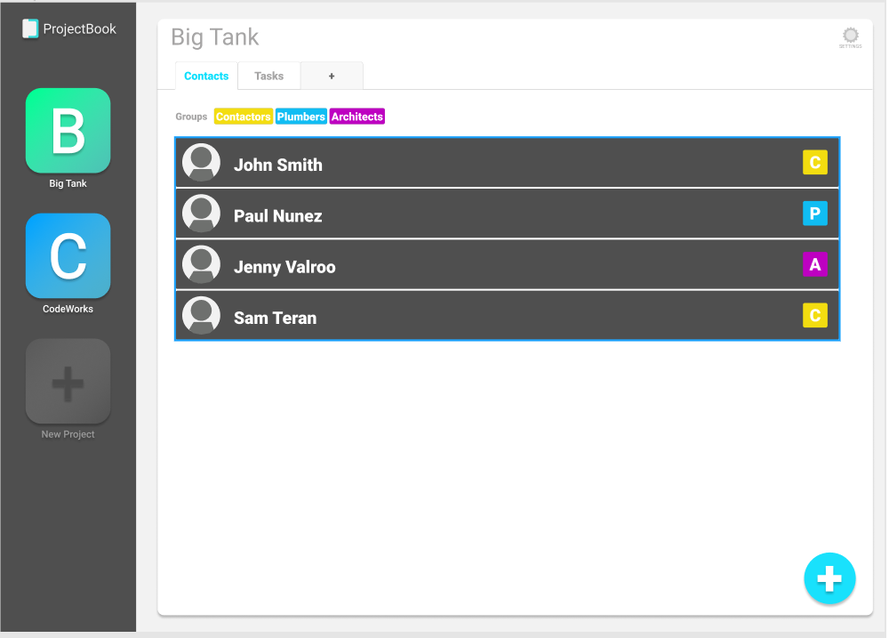

# web201-projectbook

It is time to create a project to help you keep track of all the projects you need to create. 

### Goals

We need an application that allows users to create a series of projects. Each project can have a set of pages where users can keep track of various things.
This project is inteded to be used to learn the concepts around MVC and asynchronous programming.


### Lab 1

The goal for this first lab is to add to projects the concept of a page. For the first page we will focus on being able to create a contact list that is tied to the project.

With each project I want to be able to create groups which I can use as tags among all pages of my project. For example see the image below.

You will need to create at least 2 models one for contacts and another for groups. Each of these models should reference the project that they are tied to using the project's id. The projectId is required and will help us setup relationships in the future.

```javascript
export class Group
{
  constructor({name, color, projectId}){
    this.name = name;
    this.color = color; 
    this.projectId = projectId;
  }
}
```


We are not ready to start working with async code yet so for now let's save projects our current data to localstorage. Then spend some time working on CSS. 




